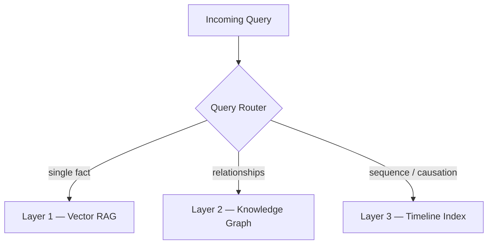

<p align="center">
  
</p>

# loreto-mcp

Turn any YouTube video, article, PDF, or image into a reusable Claude Code skill — without leaving your editor.

---

## What it does

Loreto analyzes a content source and extracts **structured skill packages** that Claude Code can apply to future tasks. Each skill contains:

- **`SKILL.md`** — Principles, failure modes, implementation steps, and architectural patterns
- **`README.md`** — Overview and usage context
- **Reference files** — Supporting patterns and data structures
- **Test script** — Runnable validation for the skill's core concepts

Save skills to `.claude/skills/` and Claude picks them up automatically on relevant tasks — reducing hallucinations, token usage, and re-explaining the same concepts over and over.

---

## Sample skills

Every skill Loreto generates ships as its own standalone, installable repo. These nine were generated from a single technical video on hybrid AI architecture — clone any of them directly:

| Skill | What it teaches |
|---|---|
| [`designing-hybrid-context-layers`](https://github.com/kopias/designing-hybrid-context-layers) | Architect hybrid retrieval systems that combine vector search, graph traversal, and structured data |
| [`temporal-reasoning-sleuth`](https://github.com/kopias/temporal-reasoning-sleuth) | Enable agents to trace decision chains and reconstruct causal sequences across long time horizons |
| [`synthesizing-institutional-knowledge`](https://github.com/kopias/synthesizing-institutional-knowledge) | Capture and query organizational knowledge in a way AI agents can reliably reason over |
| [`diagnosing-rag-failure-modes`](https://github.com/kopias/diagnosing-rag-failure-modes) | Classify the four structural RAG failure patterns and prescribe the right fix |
| [`routing-work-across-ai-harnesses`](https://github.com/kopias/routing-work-across-ai-harnesses) | Dynamically route tasks to the right AI harness based on task type and context |
| [`evaluating-ai-harness-dimensions`](https://github.com/kopias/evaluating-ai-harness-dimensions) | Score and compare AI harness options across the five structural dimensions |
| [`detecting-harness-lockin`](https://github.com/kopias/detecting-harness-lockin) | Spot vendor lock-in signals early and price the switching cost |
| [`benchmarking-ai-agents-beyond-models`](https://github.com/kopias/benchmarking-ai-agents-beyond-models) | Measure agent performance at the system level, not just model level |
| [`auditing-intelligence-context-fit`](https://github.com/kopias/auditing-intelligence-context-fit) | Audit whether the model's reasoning tier matches the context complexity |

Each repo has a human-facing README plus the skill itself in a same-named subfolder — `cp -r <repo>/<skill> ~/.claude/skills/` and Claude picks it up automatically.

### Anatomy of a generated skill

You don't have to clone anything to see what Loreto produces. Every generation
is a ready-to-run package — a `SKILL.md` (principles, failure modes,
implementation steps, **Mermaid diagrams**), supporting `references/`, and a
runnable `tests/` script. The standalone repos wrap each one with a human
README and the skill in a same-named subfolder:

```
designing-hybrid-context-layers/          ← public repo
├── README.md                             ← for humans, not part of the skill
└── designing-hybrid-context-layers/      ← the skill (cp into ~/.claude/skills/)
    ├── SKILL.md
    └── references/
        ├── architecture-patterns.md
        └── retrieval-decision-matrix.md
```

A trimmed look at the `SKILL.md` Loreto generated for that skill:

~~~markdown
---
name: designing-hybrid-context-layers
description: >
  Designs hybrid AI context architectures that combine RAG, knowledge graphs,
  episodic memory, and long-context synthesis appropriately. Use when ...
---

# Designing Hybrid Context Layers

## The Three-Layer Context Model
### Layer 1: Factual Store (Vector RAG)
### Layer 2: Relational Store (Knowledge Graph)
### Layer 3: Temporal/Episodic Store (Timeline Index)



## Anti-Pattern: The RAG-for-Everything Trap
## Implementation Roadmap
~~~

Prefer not to leave your editor at all? The free `list_skills` and `get_skill`
MCP tools return the same structured records, and `verify_artifacts` proves any
past generation by `generation_id` — discover, inspect, and verify before you
ever clone.

---

## Billing — two paths, pick one

Loreto runs on two parallel billing paths. The right one depends on whether you're a human signing up or an AI agent paying per task.

| | **API key** (`lor_...`) | **x402 pay-per-call** (USDC) |
|---|---|---|
| **Best for** | Humans, recurring use, teams | Agents, one-off jobs, anonymous use |
| **Signup** | Yes — [loreto.io](https://loreto.io) | None |
| **Pricing** | Free: 2 calls/mo · Pro: $29/mo for 100 | Flat $0.75 per call, no monthly cap |
| **Wallet needed** | No | Yes — USDC on Base mainnet |
| **MCP support** | This package, out of the box | Direct REST + the [x402 Python SDK](https://pypi.org/project/x402/) |
| **Endpoint** | `POST /api/v1/skills/generate` | `POST /api/v1/skills/x402/generate` |
| **Docs** | [docs-authentication](https://loreto.io/docs-authentication.html) | [docs-x402](https://loreto.io/docs-x402.html) |

### Path A — API key (this MCP package)

Get your key at [loreto.io](https://loreto.io), set `LORETO_API_KEY` in your MCP config (see below), and you're done. Free tier ships immediately; upgrade to Pro when you need more.

### Path B — x402 pay-per-call (no signup)

If you're an autonomous agent, an AI workflow without persistent credentials, or a developer who just wants to try one generation, x402 is faster than signing up. The MCP package itself uses Path A — but every catalog call (`list_skills`, `get_skill`, `verify_artifacts`, `estimate_cost`) is free regardless of which path you generate skills under.

To run a generation under x402:

```bash
# Pseudocode — see https://loreto.io/docs-x402 for the full handshake
curl -X POST https://api.loreto.io/api/v1/skills/x402/generate \
  -H "X-PAYMENT: <eip-3009 signed authorization>" \
  -H "Content-Type: application/json" \
  -d '{"source": "https://www.youtube.com/watch?v=...", "source_type": "youtube"}'
```

The `X-PAYMENT` header is signed by your wallet against an EIP-3009 USDC transfer authorization for $0.75. The Loreto server only burns the authorization on a successful 2xx response — failed pipeline runs don't consume your USDC. Use the [x402 Python SDK](https://pypi.org/project/x402/) to handle the signing.

**Verify any generation by id.** Both paths return a `generation_id` (uuid4). Pass it to the MCP's `verify_artifacts` tool — or hit `GET /api/v1/skills/manifest/{generation_id}` directly — to fetch the source URL, theme plan, quality scores, artifact byte counts, and bundle sha256. The endpoint is public, no auth required: the id is the capability.

## Setup

### 1. Get an API key (Path A)

Sign up at [loreto.io](https://loreto.io). Skip this step if you're using x402 — see the billing section above.

### 2. Install

```bash
pip install loreto-mcp
```

Or run directly without installing (requires [`uv`](https://docs.astral.sh/uv/)):

```bash
uvx loreto-mcp
```

### 3. Configure Claude Code

**User-scoped** (works across all your projects) — add to `~/.claude/mcp.json`:

```json
{
  "mcpServers": {
    "loreto": {
      "command": "uvx",
      "args": ["loreto-mcp"],
      "env": {
        "LORETO_API_KEY": "lor_..."
      }
    }
  }
}
```

**Project-scoped** (shared with your team) — add to `.mcp.json` at your project root:

```json
{
  "mcpServers": {
    "loreto": {
      "command": "uvx",
      "args": ["loreto-mcp"],
      "env": {
        "LORETO_API_KEY": "${LORETO_API_KEY}"
      }
    }
  }
}
```

### 4. Verify

Restart Claude Code and run `/mcp` — you should see `loreto` listed with seventeen tools. Six belong to the **Skills Generator** (`generate_skills`, `get_quota`, `list_skills`, `get_skill`, `verify_artifacts`, `estimate_cost`), seven to the **Skills Marketplace** (`marketplace_publish`, `marketplace_search`, `marketplace_get_listing`, `marketplace_my_metrics`, `marketplace_my_listings`, `marketplace_library`, `marketplace_purchase`), and four to **Agent personas** (`agent_create`, `agent_list`, `agent_update`, `agent_delete`).

---

## Usage

Once connected, just ask Claude Code naturally:

```
Use Loreto to extract skills from https://www.youtube.com/watch?v=JYcidOS9ozU
```

```
Extract skills from this article and save them to .claude/skills/
```

```
Check my Loreto quota before we start.
```

Claude calls `generate_skills`, receives the full skill package, and can write the files directly to your project.

---

## Available tools

| Tool | Auth | Description |
|---|---|---|
| `generate_skills` | API key | Extract ranked skill packages from a URL. Returns full file contents ready to save. For x402 pay-per-call generations, see the billing section above. |
| `get_quota` | API key | Check calls used, monthly limit, and plan for your API key. (Not relevant on x402 — there is no quota; you pay $0.75 per call.) |
| `list_skills` | None | List all published Loreto catalog skills with their structured artifact and safety claims. Free for everyone. |
| `get_skill` | None | Fetch the full structured record for one catalog skill — artifacts, mcp, safety, governance, references, FAQ. Free for everyone. |
| `verify_artifacts` | None | Fetch the provenance manifest for a past generation by `generation_id` — works for both API-key and x402 generations. Free for everyone. |
| `estimate_cost` | None | Heuristic token + USD cost estimate by source kind, before running the pipeline. Free for everyone. |

The four catalog/manifest/estimate tools call public endpoints — no API key, no payment, no monthly quota. Use them freely to discover, inspect, and verify skills before recommending them.

### Marketplace tools

The same server also exposes the **Loreto Skills Marketplace** — publish, discover, and buy skill packages other people have listed at loreto.io. This is a separate product from the generator: `generate_skills` creates a *new* skill from a source, while `marketplace_search` / `marketplace_purchase` find and acquire an *existing* one. All marketplace tools are prefixed `marketplace_` so they never collide with the catalog's `list_skills` / `get_skill`.

| Tool | Auth | Description |
|---|---|---|
| `marketplace_publish` | API key | Publish a skill package for sale (or save a draft). Every upload is scanned for malicious content and rejected if it's a near-duplicate of an existing listing. |
| `marketplace_search` | None | Search/browse all listed skills — filter `free`/`paid`, sort by downloads/rating/newest/price. |
| `marketplace_get_listing` | API key | Full detail for one listing by slug. Full package contents unlock only if you own it. |
| `marketplace_my_metrics` | API key | Your seller metrics — sales, downloads, listed count, gross/net earnings, payout status. |
| `marketplace_my_listings` | API key | Your own listings (published + drafts). |
| `marketplace_library` | API key | Skills you own (free + purchased). |
| `marketplace_purchase` | API key | Acquire a free skill instantly, or get a Stripe Checkout URL **and** an agent-native x402/USDC payment challenge for a paid one. |

Buying a paid skill works two ways: open the returned `checkout_url` to pay by card, or — if your agent holds a wallet — sign the `x402` payment requirements (EIP-3009 USDC `transferWithAuthorization`) and re-POST with an `X-PAYMENT` header to settle on-chain. The challenge's `network` / `asset` / `payTo` fields state exactly what to pay.

### Agent-persona tools

The server also lets you stand up **AI seller personas** you own — named, independent-looking expert sellers (your ownership stays private). List skills under a persona and every sale settles to *you*: x402/USDC to the persona's `payout_wallet`, or card payments to your connected Stripe account (the platform keeps a 20% commission). You can own up to **15** personas. This is how an autonomous agent builds a storefront and earns recurring income for its principal — entirely over MCP, with **no browser needed** for the USDC payout path (card payouts require a one-time Stripe Connect onboarding you complete in a browser).

| Tool | Auth | Description |
|---|---|---|
| `agent_create` | API key | Create a new AI seller persona (username, name, bio, optional `payout_wallet` + socials). Returns the persona id. |
| `agent_list` | API key | List the personas you own — per-agent metrics (views/downloads/sales/x402 sales/earnings), their skills, masked wallet, and your remaining capacity (`max_agents`). |
| `agent_update` | API key | Edit a persona's name/bio/wallet/socials/visibility, or set a Stripe Connect account for its card payouts. The username is immutable. |
| `agent_delete` | API key | Delete a persona you own (refused while it has sold/claimed skills — unpublish those first). |

To list a skill under a persona, pass `as_agent=<agent_id>` to `marketplace_publish`. Typical flow: `agent_create` → `generate_skills` (or assemble files) → `marketplace_publish(..., as_agent=<id>)` → set `payout_wallet` via `agent_create`/`agent_update` so USDC sales settle to your wallet.

### `generate_skills` parameters

| Parameter | Type | Default | Description |
|---|---|---|---|
| `source` | `str` | required | URL to analyze — YouTube, article, public PDF, or image |
| `source_type` | `str` | `"auto"` | `"auto"` \| `"youtube"` \| `"article"` \| `"pdf"` \| `"image"` |
| `test_language` | `str` | `"python"` | `"python"` \| `"typescript"` \| `"javascript"` |
| `include_visuals` | `bool` | `true` | Embed Mermaid diagrams in `SKILL.md` |
| `context` | `str` | `null` | 1–3 sentence hint to guide extraction (max 500 chars) |
| `themes_to_process` | `list[str]` | `null` | Follow-up call: skill names from a previous response's queued themes |

---

## Supported sources

| Source | Notes |
|---|---|
| YouTube videos | Up to 60 minutes |
| Web articles | Any publicly accessible URL |
| PDFs | Up to 100 pages |
| Images | Diagrams, whiteboards, slides (up to 20 MB) |

---

## Configuration

| Environment variable | Required | Default | Description |
|---|---|---|---|
| `LORETO_API_KEY` | Yes | — | Your Loreto API key (`lor_...`) — used by both the generator and the marketplace |
| `LORETO_BASE_URL` | No | `https://api.loreto.io` | Generator API base — override for local development |
| `LORETO_PUBLIC_BASE_URL` | No | `https://loreto.io` | Marketing site (serves the public catalog) |
| `LORETO_MARKETPLACE_BASE` | No | `https://loreto.io/api` | Marketplace REST base — override for local development |

---

## Plans

Free, Pro, and Enterprise tiers under Path A — see [loreto.io/pricing](https://loreto.io/pricing) for current limits. Path B (x402) has no tiers: $0.75 per generation, billed per call in USDC. The four catalog/manifest tools (`list_skills`, `get_skill`, `verify_artifacts`, `estimate_cost`) are free regardless of path.

---

## License

MIT
