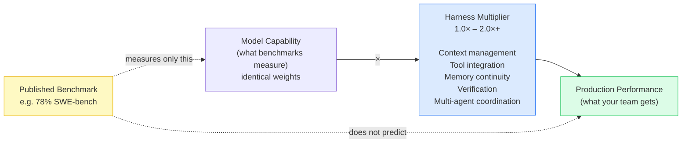

# Benchmarking AI Agents Beyond Models

## The Benchmark Blind Spot

Published AI benchmarks almost universally test models in isolation or within a single
reference harness. They compare "brains in jars." The body — where the brain actually
does its work — is not part of the comparison.

This produces a systematic blind spot: the same model can perform radically
differently in production depending on its harness.

> "The same Claude model, identical weights, identical training, scored 78% on the
> SWE-bench benchmark inside Claude Code's harness, but scored 42% inside a different
> harness built by another startup. Same brain, different body, nearly double the
> performance."

A benchmark score is not a prediction of what that model will do in your environment.
It is a measurement of what that model + reference harness did in the benchmark
environment. These are not the same thing.

---

## The Performance Decomposition Model

Agent performance in production = model capability × harness multiplier

Where:
- **Model capability**: the intelligence of the underlying weights (what benchmarks measure)
- **Harness multiplier**: context management quality × tool integration depth × memory
  continuity × verification mechanism × multi-agent coordination

The harness multiplier can be as high as 2× (or more) on the same model, and it
varies significantly across task types.



| Factor | Effect |
|---|---|
| Poor context management | Model re-derives context it already had; errors accumulate |
| Missing tool access | Model hallucinates tool outputs it cannot actually call |
| No cross-session memory | Each session starts from scratch; no compounding progress |
| No verification | Bugs pass through undetected; model cannot measure acceptance criteria |
| No multi-agent coordination | Serial execution where parallel work was possible |

---

## Evaluating Benchmarks Correctly

Before treating a benchmark result as a performance prediction, ask:

### Question 1: Which harness was used in the benchmark?

- Was the model tested in its native harness, a reference harness, or an isolated setting?
- If native harness: the benchmark reflects that specific harness + model combination;
  it does not transfer to other harnesses running the same model.
- If isolated: the benchmark understates performance in a well-designed harness and
  may overstate it in a poorly designed one.

### Question 2: Does the benchmark task match your task type?

Common benchmark tasks favor certain harness capabilities:
- Code generation tasks favor isolated harnesses with deterministic enforcement
- Multi-session project tasks favor harnesses with strong memory and context continuity
- Multi-step agent tasks favor harnesses with strong orchestration and tool integration

If the benchmark task type does not match your production task type, the score is
not predictive.

### Question 3: What is the harness-controlled variable?

A fair model comparison holds the harness constant and varies only the model weights.
Most published comparisons do not do this — they compare total packages (model +
harness) while attributing all value to the model.

**If the harness is not held constant, you are not comparing models. You are comparing systems.**

---

## The Harness-Aware Evaluation Protocol

To evaluate an AI coding agent for your team's actual use case:

### Step 1: Define your representative task set

Select 5–10 tasks representative of your team's highest-volume work:
- Proportion of planning vs. implementation tasks
- Proportion of independent vs. interdependent tasks
- Session length (short bursts vs. multi-session projects)
- Tool requirements (local tools vs. repo-only)

Do not use generic coding benchmarks. Use your team's actual work.

---

### Step 2: Hold the model constant, vary the harness (when possible)

If comparing harnesses on the same model: run the same task in each harness with
identical model weights. Attribute performance differences to the harness.

If the model is not the same across platforms: acknowledge that you are measuring
system performance, not model performance. Do not attribute output differences to
the model alone.

---

### Step 3: Measure task-level outcomes, not token-level metrics

| Metric | Why It Matters |
|---|---|
| Task completion rate | Did the agent actually finish the task across multiple sessions? |
| Bug rate (per 100 lines) | What is the defect density of agent-generated code? |
| Verification pass rate | How often did the agent's output pass acceptance criteria on first submission? |
| Session restart overhead | How much context reconstruction is required at the start of each session? |
| Cross-session consistency | Does the agent's behavior improve over time as context accumulates? |

Avoid measuring only: response speed, token cost per query, or benchmark score
reproduced in your environment. These miss the harness multiplier.

---

### Step 4: Evaluate the harness dimensions that affect your task set

Use the `evaluating-ai-harness-dimensions` framework to score each harness on the
five dimensions that matter for your representative task set. Weight dimensions by
frequency in your task set.

---

### Step 5: Produce a system-level performance report

```
AGENT SYSTEM EVALUATION REPORT
================================
Task Set: [description of representative tasks used]
Models Evaluated: [list]
Harnesses Evaluated: [list]
Evaluation Period: [dates]

Performance Results:
  [Model + Harness A]: Task completion: X%, Bug rate: Y per 100 lines,
    Verification pass rate: Z%, Session restart overhead: W minutes
  [Model + Harness B]: ...

Harness Multiplier Observed:
  [Quantify performance difference attributable to harness vs. model]

Benchmark Score Correlation:
  Did published benchmark scores predict your observed results? [yes / no / partially]
  Where they diverged: [explain]

Recommendation:
  [Which system to use for which task category, and why]
```

---

## Interpreting Published Comparisons

When you read a model comparison:

| Claim | What to Ask |
|---|---|
| "Model A scored X% on SWE-bench" | Which harness? Was it held constant across models? |
| "Model A is better than Model B at coding" | Both tested in same harness? Or total packages compared? |
| "Our new model improves performance by 20%" | Improvement from model or from harness update? |
| "In production, developers prefer Model A" | Was this measured with same harness, or each model in its native harness? |

**Default assumption**: unless a benchmark explicitly states the harness was held constant
and the same across all tested models, the comparison is of total packages (model + harness),
not models alone. Treat accordingly.

---

## Anti-Patterns

### Anti-Pattern: Benchmarking a model in isolation and deploying in a harness
A model evaluated without a harness (pure API completion) behaves differently from the
same model running inside a harness that manages context, memory, tools, and verification.
Isolation benchmarks underestimate harness-integrated performance.

**Fix**: Evaluate the model in the harness you intend to deploy it in.

### Anti-Pattern: Reading benchmark headlines and skipping the harness footnotes
Benchmark papers often contain footnotes about test configuration (harness used,
context management approach, tool availability) that significantly affect the result.
Headlines omit these.

**Fix**: Read methodology sections of any benchmark you are citing for procurement.
Identify the harness used. Assess whether it matches your deployment configuration.

### Anti-Pattern: Attributing all performance gains to model improvements
When a vendor releases a new model version and performance improves, the improvement
may come from the model, the harness, or both. Marketing materials attribute everything
to the model.

**Fix**: When a model update ships with a harness update, run ablation tests: new model
in old harness, and old model in new harness. Isolate the source of improvement before
attributing it.

---

## References

- Harness dimension evaluation → `evaluating-ai-harness-dimensions/SKILL.md`
- Harness lock-in implications for procurement → `detecting-harness-lockin/SKILL.md`
