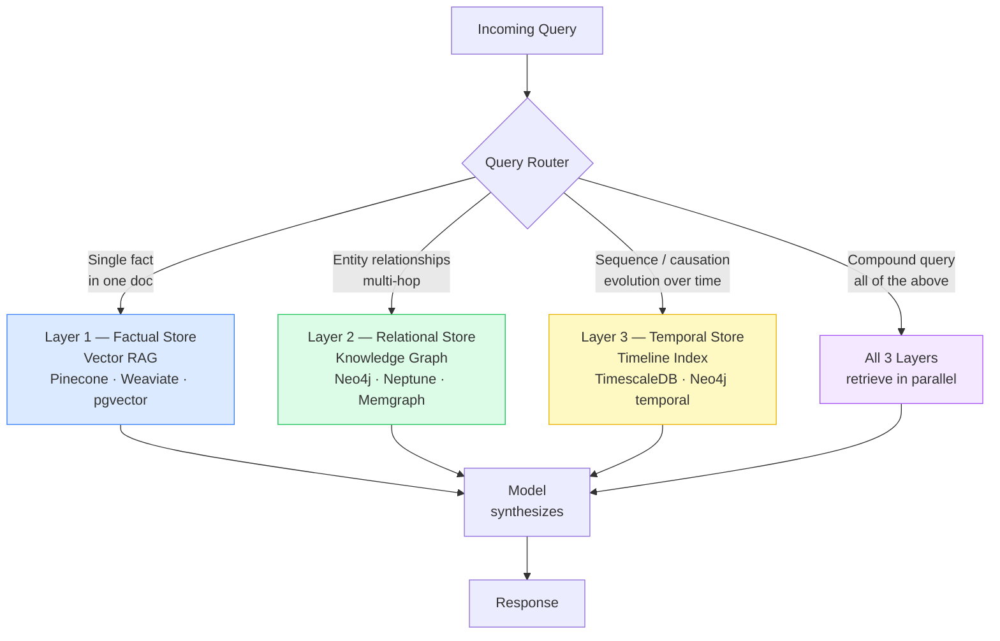
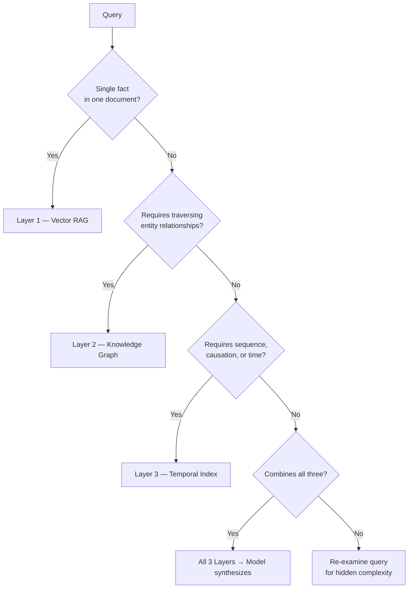

# Designing Hybrid Context Layers

## The Multiplicative Principle

Output quality is not the sum of model intelligence and context quality — it is the product:

```
output_quality = reasoning_tier × context_quality
```

Consequences:
- Good model + poor context = degraded output (context poisons reasoning)
- Poor model + excellent context = ceiling hit fast (reasoning can't leverage it)
- Long context + weak reasoning = harmful output (more signal, more hallucination surface)

This means context architecture is not an afterthought. The retrieval strategy must match both the query type and the model's reasoning capability.

---

## The Three-Layer Context Model

### Layer 1: Factual Store (Vector RAG)
**Best for**: Point queries, lookup, single-hop fact retrieval
**Technology**: Vector database (Pinecone, Weaviate, pgvector)
**Data shape**: Chunked documents with embeddings + metadata (source, date, author, tags)

Queries routed here:
- "What does our SLA say about uptime?"
- "What is the current value of config key X?"
- "List all services tagged as PII-handling"

**Limitation**: Cannot join facts across documents or reason about sequence.

---

### Layer 2: Relational Store (Knowledge Graph)
**Best for**: Entity relationships, multi-hop queries, "what connects to what"
**Technology**: Graph database (Neo4j, Amazon Neptune, Memgraph)
**Data shape**: Nodes (entities: people, systems, decisions, policies) + edges (relationships: depends-on, owns, supersedes, references)

Queries routed here:
- "Which teams own services that depend on the deprecated API?"
- "What decisions reference the Q3 incident report?"
- "What is the chain of approvals for this configuration change?"

**Limitation**: Doesn't natively represent time or causation without explicit temporal edges.

---

### Layer 3: Temporal/Episodic Store (Timeline Index)
**Best for**: Event sequences, decision chains, causal reasoning, "how did we get here"
**Technology**: Time-series DB or graph DB with timestamped event nodes (InfluxDB, TimescaleDB, or Neo4j with temporal edges)
**Data shape**: Event nodes with (timestamp, actor, action, context, linked-events, causal-predecessors)

Queries routed here:
- "What sequence of events led to the current vulnerability?"
- "How has our deployment frequency changed over the past year?"
- "What caused the migration decision in March?"

**Limitation**: High ingestion cost; requires structured event capture at the source.

---

## Architecture Overview



---

## Query Routing Decision

Before retrieving, classify the query:



For compound queries, retrieve from all applicable layers and pass structured context to the model for synthesis. Do not attempt to merge at the retrieval level.

---

## Anti-Pattern: The RAG-for-Everything Trap

Using RAG for all three query types causes:
1. **Structural failure** on relational/temporal queries (see `diagnosing-rag-failure-modes`)
2. **Cost escalation** — reranking thousands of chunks to compensate for architectural mismatch
3. **Reasoning plateau** — when model hits its context ceiling, the system silently degrades into expensive RAG rather than failing loudly

The symptom is often: "we added more context and the answers got *worse*."

---

## Implementation Roadmap

For teams starting from RAG-only:

1. **Audit current failures** — classify which queries are failing and which pattern they hit (use `diagnosing-rag-failure-modes`)
2. **Add graph layer first** — most orgs have multi-hop relational failures before temporal ones
3. **Instrument event capture** — establish structured event schema before building temporal index (retroactive ingestion is expensive)
4. **Build query router** — classify queries before retrieval; don't retrieve from all layers on every query
5. **Audit model fit** — verify reasoning tier matches context complexity (use `auditing-intelligence-context-fit`)

---

## References

- Architecture patterns with implementation detail → `references/architecture-patterns.md`
- Query routing decision matrix (detailed) → `references/retrieval-decision-matrix.md`
