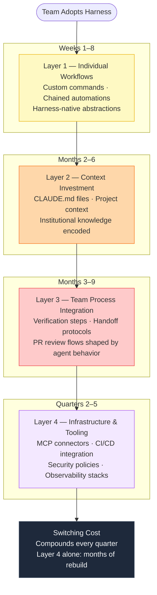

# Detecting Harness Lock-in

## The Lock-in Mechanism

When a team adopts an AI coding agent, they do not just adopt a subscription.
They begin accumulating process infrastructure specifically shaped by that harness:

- Workflow automation built around the harness's abstractions (skill systems, context
  forking, sub-agent models)
- Context files that encode project history in formats the harness expects
- MCP connectors deployed and tuned for the harness's integration model
- Team habits, verification steps, and review protocols designed around agent behavior
- Documentation structured to be legible to that specific agent

Each layer compounds. After six months, switching harnesses does not mean learning
new commands — it means rebuilding a layered chain of automation in an architecture
that may not support the same abstractions at all.

> "The organization's building workflows around these tools. They're not just adopting
> a subscription. They're building institutional knowledge and process documentation
> and verification protocols around a specific agent architecture."

This is the lock-in nobody prices into their initial decision.

---

## The Lock-in Accumulation Model

Lock-in compounds through four layers that accrue in roughly this order:



**Key property**: Each layer makes every subsequent layer harder to unwind. Layer 4
alone is painful. Layers 1–4 together may be organizationally prohibitive.

---

## Lock-in Detection Audit

Run this audit when evaluating whether to change harnesses, or before committing
to a harness for a team:

### Layer 1: Individual Workflow Automation

- [ ] How many custom commands or skill automations do developers actively use?
- [ ] Are those automations chained (each one depends on a previous one)?
- [ ] Are the abstractions used (skill systems, context forking, sub-agent delegation)
      native to this harness, or portable?
- [ ] How long would it take one developer to rebuild their personal workflow stack
      in a different harness?

**Lock-in signal**: 3+ chained automations per developer, built on harness-native
abstractions. Each additional layer doubles the rebuild cost.

---

### Layer 2: Context Investment

- [ ] Does the team maintain CLAUDE.md or equivalent context files?
- [ ] How much accumulated project context is encoded in harness-specific formats?
- [ ] Would that context be legible to a different harness? (e.g., a harness that
      uses repo-as-memory would not benefit from CLAUDE.md files)
- [ ] How many person-hours have gone into context file maintenance this quarter?

**Lock-in signal**: Context files with > 1,000 lines per project; context
that encodes architectural decisions, not just instructions.

---

### Layer 3: Team Process Integration

- [ ] Have verification steps been designed around agent behavior specific to this harness?
- [ ] Are handoff protocols between human and agent work harness-specific?
- [ ] Has the team's PR review workflow changed to accommodate this agent's output patterns?
- [ ] Would a new agent require those protocols to be rewritten from scratch?

**Lock-in signal**: Verification steps that assume specific agent output formats or
behaviors that differ across harnesses.

---

### Layer 4: Infrastructure and Tooling

- [ ] How many MCP connectors have been deployed and tuned?
- [ ] Is CI/CD integrated with the harness's execution model (local vs. sandboxed)?
- [ ] Are security policies written around local execution or sandboxed execution?
- [ ] Have observability stacks been configured for this harness's tracing model?

**Lock-in signal**: Infrastructure decisions (security policies, CI/CD pipelines)
that encode assumptions about execution model. These are the hardest to undo.

---

## Switching Cost Estimation

After running the audit, estimate switching cost using this framework:

| Layer | Weeks to Rebuild | Multiplied by Team Size | Notes |
|---|---|---|---|
| Individual workflows | 1–2 weeks per developer | × N developers | Chained automations multiply this |
| Context investment | 1–4 weeks per project | × active projects | Re-encoding institutional knowledge |
| Team processes | 2–6 weeks | × teams affected | Requires behavior change, not just tooling |
| Infrastructure | 4–12 weeks | × deployment complexity | Security policies are the long tail |

**Total switching cost** = sum of above, accounting for compounding between layers.

**Critical insight**: This cost goes up every quarter. Every quarter your team is
building more infrastructure around the current architecture. If a harness switch
is likely in the next 12 months, the best time to price it is now.

---

## The Philosophy Lock-in Dimension

Beyond tooling, harness lock-in includes lock-in to the model maker's philosophy
of how humans and AI work together:

| Philosophy | Expressed As |
|---|---|
| "Bash is all you need" | Composable Unix primitives; full local access; trust through incrementalism |
| "The repo is the system of record" | Anything not in the repo doesn't exist; isolation enforces consistency |

These philosophies shape what your team believes good AI-assisted development looks
like. Switching harnesses often requires not just rebuilding tools, but re-orienting
the team's mental model of how human-AI collaboration should work.

---

## Lock-in Audit Output

```
HARNESS LOCK-IN AUDIT
======================
Current Harness: [tool name]
Audit Date: [date]

Layer 1 — Workflow Automation:
  Developer automation chains: [count] per developer
  Harness-native abstractions in use: [list]
  Portability: [portable / partially portable / not portable]

Layer 2 — Context Investment:
  Context files maintained: [yes/no, approximate size]
  Harness-specific format: [yes/no]
  Estimated rebuild effort: [person-hours]

Layer 3 — Team Process Integration:
  Harness-specific verification steps: [yes/no, description]
  Protocol rebuild effort: [person-weeks]

Layer 4 — Infrastructure:
  MCP connectors deployed: [count]
  Security policies encoded for execution model: [yes/no]
  Infrastructure rebuild effort: [person-weeks]

Total Estimated Switching Cost: [person-weeks]
Switching Cost Growth Rate: [low / medium / high] — increases [monthly/quarterly]

Recommendation:
[Commit to current harness | Evaluate switch now before further accrual |
 Design hybrid workflow to reduce single-harness dependency]
```

---

## Anti-Patterns

### Anti-Pattern: Treating a harness as just a subscription
A subscription can be cancelled with a month's notice. A harness commitment is an
architectural commitment that shapes team process for years. Pricing it like a
subscription leads to under-investment in the decision.

**Fix**: Treat the initial harness selection with the same rigor as a major
infrastructure decision. Run the full lock-in audit before committing.

### Anti-Pattern: Evaluating switching cost only at the model layer
Teams often estimate switching cost as "how long will it take to retrain on new
commands?" This captures Layer 1 only. Layers 2–4 are 3–5× more expensive.

**Fix**: Run all four layers of the audit. The infrastructure layer is almost always
underestimated.

### Anti-Pattern: Not pricing the compounding rate
Lock-in is not static. Every quarter adds a new layer. A switch that costs 8 weeks
today may cost 20 weeks in 6 months. The question is not "how much does it cost to
switch?" but "how fast is that cost growing?"

**Fix**: Reassess switching cost quarterly. If the growth rate is high and a switch
is plausible, move sooner rather than later.

---

## References

- Harness dimension evaluation → `evaluating-ai-harness-dimensions/SKILL.md`
- Task routing to reduce single-harness dependency → `routing-work-across-ai-harnesses/SKILL.md`
