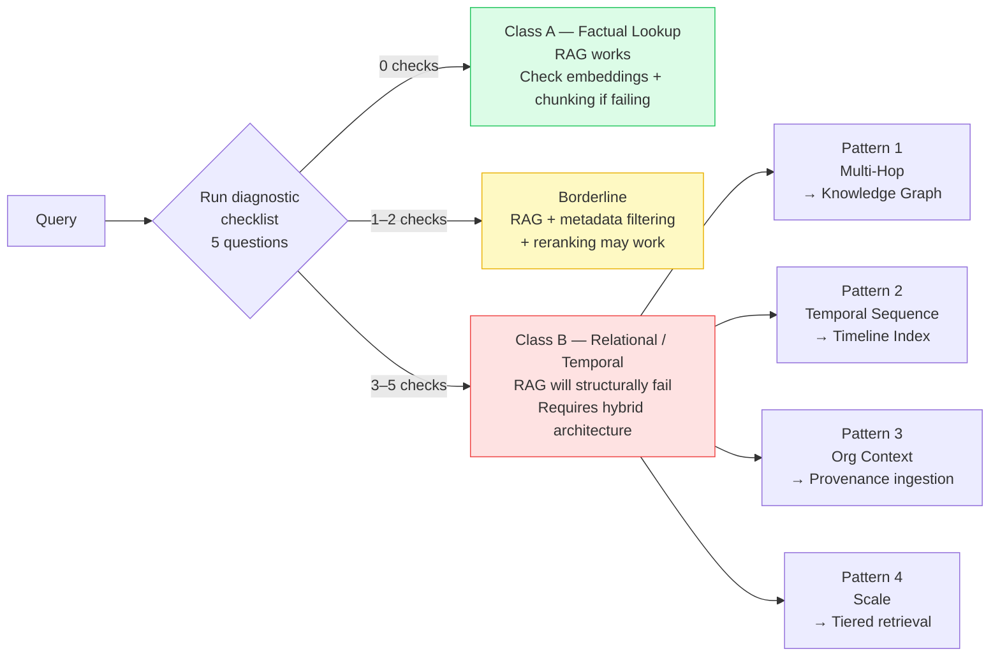

# Diagnosing RAG Failure Modes

## The Two Query Classes

Every query against an organizational knowledge base falls into one of two classes:

**Class A — Factual Lookup (RAG-safe)**
- "What is our data retention policy?"
- "What version of X is deployed in production?"
- Point queries. Single-hop. The answer lives in one document.

**Class B — Relational/Temporal (RAG danger zone)**
- "What decisions led to the current architecture?"
- "Why did we choose vendor X over vendor Y?"
- "What sequence of events caused the Q3 outage?"
- Multi-hop. Requires traversing relationships across documents and time.

RAG is designed for Class A. When applied to Class B, it retrieves facts but loses the connective tissue between them — relationships, causation, sequence.



---

## Diagnostic Checklist

Run through this checklist for the failing query:

- [ ] Does the answer require joining facts from more than one document?
- [ ] Does the answer require knowing the *order* in which events occurred?
- [ ] Does the answer require understanding *why* a decision was made, not just what it was?
- [ ] Does the answer span a time period longer than a single document's scope?
- [ ] Does the answer require following a causal chain (A caused B, which led to C)?

**Scoring:**
- 0 checked → Class A (RAG should work; look for embedding quality or chunking issues)
- 1–2 checked → Borderline (RAG may work with metadata filtering and reranking)
- 3+ checked → Class B (RAG will structurally fail; requires hybrid architecture)

---

## The Four RAG Failure Patterns

### Pattern 1: Multi-Hop Relational Failure
**Symptom**: Retrieval finds relevant documents but the answer requires connecting facts across them in ways the embedding space doesn't capture.

**Example**: "Which teams are affected by the API deprecation?" — requires: find deprecation notice → find all services using that API → find team owners for those services. Each hop retrieves different documents; no single query covers the chain.

**Fix**: Knowledge graph with entity relationships. See `designing-hybrid-context-layers`.

---

### Pattern 2: Temporal Sequencing Failure
**Symptom**: Agent retrieves correct facts but cannot reason about their order or how the situation evolved.

**Example**: "How did our authentication system get to its current state?" — requires reconstructing a sequence of decisions, migrations, and incidents over 18 months. No single chunk contains this; cosine similarity cannot sort by time.

**Fix**: Timeline/episodic index with timestamped event nodes. See `temporal-reasoning-sleuth`.

---

### Pattern 3: Organizational Context Failure
**Symptom**: Retrieval returns isolated facts stripped of their original context (who decided this, why, what constraints existed at the time).

**Example**: "Should we use the same vendor for this new contract?" — requires knowing not just what the vendor does, but the history of relationship, past incidents, pricing disputes, and strategic rationale. Embedding a contract PDF loses all that provenance.

**Fix**: Structured knowledge ingestion that captures provenance fields (who, what, when, why, linked-decisions). See `synthesizing-institutional-knowledge`.

---

### Pattern 4: Scale Failure
**Symptom**: RAG performs adequately on small corpora but degrades as org history grows into hundreds of thousands of documents. Recall drops; latency increases; cost becomes prohibitive.

**Root cause**: At scale, the query embedding cannot distinguish the 3 truly relevant documents from the 300 semantically adjacent ones. Reranking helps but doesn't solve it.

**Fix**: Tiered retrieval — use metadata filters, graph traversal, or specialized indexes to narrow candidates before embedding search.

---

## Output: Failure Classification Report

After running the diagnostic, produce this report:

```
RAG FAILURE DIAGNOSIS
=====================
Query: [the failing query]
Query Class: [A — Factual | B — Relational/Temporal]
Failure Pattern(s): [list applicable patterns from above]

Root Cause:
[One paragraph explaining why RAG structurally cannot answer this query]

Recommended Fix:
[Specific architecture change — knowledge graph / timeline index / hybrid layer]

Reference:
[Link to relevant architecture patterns]
```

---

## References

- Architecture remediation options → `designing-hybrid-context-layers/references/architecture-patterns.md`
- Decision matrix for query routing → `designing-hybrid-context-layers/references/retrieval-decision-matrix.md`
