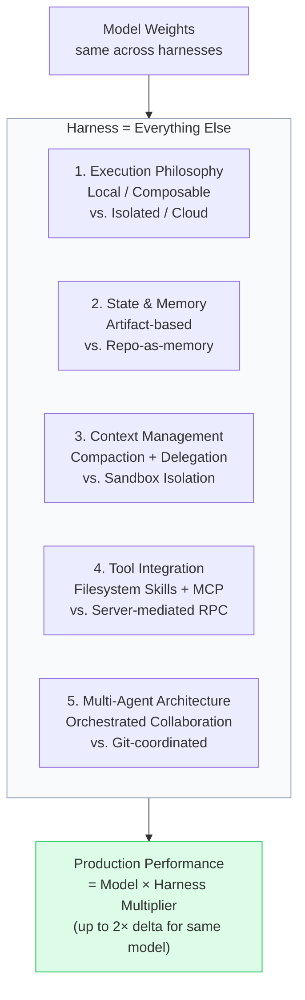

# Evaluating AI Harness Dimensions

## The Harness vs. Model Distinction

A model is the intelligence: the weights that predict tokens. A harness is everything
else: where the agent executes, what it can touch, how it remembers across sessions,
how it coordinates parallel work, and how it connects to external tools.

Benchmark comparisons almost exclusively compare models. Harnesses are rarely
evaluated, yet they are performance multipliers:

> Same Claude model, identical weights: 78% on a scientific reproducibility benchmark
> inside Claude Code's harness vs. 42% inside a different harness. Nearly double the
> performance from identical intelligence — the harness is not an optimization layer,
> it is a performance multiplier.

---

## The Five Harness Dimensions

Evaluate any AI coding agent on these five axes before committing to it.



---

### Dimension 1: Execution Philosophy

**The question**: Where does the agent do its work, and what tools does it have access to?

| Approach | Description | Trade-off |
|---|---|---|
| **Local / composable** | Agent runs in your environment with access to shell, SSH keys, env vars, system tools. Uses composable primitives (bash, git, npm) chained together. | Powerful and flexible; trust boundary is your entire workstation |
| **Isolated / cloud** | Agent runs in a sandboxed container. Code is cloned in; internet is disabled by default; agent works in a clean room and slides results under the door. | Safer by default; less able to reach tools your team already uses |

**Assessment questions:**
- Does the task require reading from your local environment (SSH keys, env vars, local services)?
- Does the task require autonomous operation where isolation reduces risk?
- Does the team need the agent to integrate with tools not natively supported?

---

### Dimension 2: State and Memory

**The question**: How does the agent maintain continuity across sessions?

| Approach | Description | Trade-off |
|---|---|---|
| **Artifact-based memory** | Agent writes structured progress files (JSON task lists, progress logs, git commits) that the next session reads on startup. Developers invest in context files that compound over time. | Memory quality improves with investment; value is agent-portable but harness-specific |
| **Repo-as-memory** | Architectural decisions, principles, and history are encoded directly into the repository as structured documentation. Anything not in the repo is invisible to the agent. | Scales well; the codebase polices itself; but requires disciplined documentation investment and automated drift correction |

**Assessment questions:**
- Where does institutional knowledge about this project currently live?
- Is the team willing to maintain repo documentation as a first-class engineering artifact?
- Will the agent need to operate on projects where repository documentation is sparse?

---

### Dimension 3: Context Management

**The question**: How does the harness handle token budget and context window pressure?

| Approach | Description | Trade-off |
|---|---|---|
| **Compaction + delegation** | Automatically summarizes older context; spawns sub-agents that each get a clean window; keeps the main context lean through just-in-time retrieval of tools and skills. | Better for tasks requiring deep understanding of a codebase in a single thread |
| **Isolation** | Each task runs in its own sandbox; no shared context window; tasks cannot pollute each other. | Better for many independent parallel tasks; each one gets a full, clean context budget |

**Assessment questions:**
- Are most tasks deeply interconnected (one agent needs the full picture) or independent (many agents working in parallel)?
- How long are typical task runs — minutes or hours?
- Is context window cost a constraint?

---

### Dimension 4: Tool Integration

**The question**: How does the harness connect the agent to external systems?

| Approach | Description | Trade-off |
|---|---|---|
| **Filesystem-based skills** | Tools and skills stored as files; agent sees only short descriptions (~50 tokens) and retrieves full instructions just-in-time. Keeps context lean; supports MCP natively. | Low token cost; composable; custom tools are just markdown + scripts |
| **Server-mediated RPC** | Bidirectional JSON-RPC harness exposes tools (git, test runners, browser dev tools, observability stack) as programmatic endpoints. Per-session ephemeral stacks. | Deep integration; structured; requires the agent to work inside the server-mediated environment |

**Assessment questions:**
- What tools does your team already use that the agent needs to reach (Jira, Figma, Slack, internal APIs)?
- Can you accept a proxy adapter for MCP integration, or do you need native support?
- How important is per-session observability (logs, metrics, DOM snapshots)?

---

### Dimension 5: Multi-Agent Architecture

**The question**: How does the harness coordinate parallel agent work?

| Approach | Description | Trade-off |
|---|---|---|
| **Orchestrated collaboration** | A coordinator agent spawns sub-agents that share task lists and dependency tracking; sub-agents can message each other; cheap fast models handle exploration and hand results to more capable models for decisions. | Creative, flexible; keeps humans in the loop as strategic overseers; sub-agent interference is possible |
| **Coordination via codebase** | Each task runs in an isolated sandbox; coordination happens through git branches and merges; agents cannot access each other's state. | Safer; no cascade failures; but parallelism coordination lags orchestration approaches |

**Assessment questions:**
- How many parallel tasks does the team run simultaneously?
- Is safety of autonomous operation more important than coordination flexibility?
- Does the team need a human-in-the-loop orchestration model, or is fully autonomous preferred?

---

## Scoring Summary

After assessing each dimension, fill in this table:

```
HARNESS DIMENSION ASSESSMENT
==============================
Platform Evaluated: [tool name]

Dimension            | Approach Observed         | Fits Team Needs?
---------------------|---------------------------|------------------
Execution Philosophy | [local/composable | cloud/isolated] | [yes / no / partial]
State & Memory       | [artifact | repo-as-memory]         | [yes / no / partial]
Context Management   | [compaction | isolation]            | [yes / no / partial]
Tool Integration     | [filesystem | server RPC]           | [yes / no / partial]
Multi-Agent Arch     | [orchestrated | git-coordinated]    | [yes / no / partial]

Key mismatches:
[List any dimensions where the harness approach conflicts with team needs]

Recommendation:
[Use / Avoid / Use for specific task types only]
```

---

## Anti-Patterns

### Anti-Pattern: Evaluating only on model benchmarks
Benchmark comparisons compare models ("brains in jars"), not harnesses. The same
model can score nearly double on the same benchmark depending on which harness
it runs inside. Benchmark scores do not transfer across harness environments.

**Fix**: Run the 5-dimension assessment above before treating any benchmark result as
a performance prediction for your team's use case.

### Anti-Pattern: Assuming harnesses are interchangeable wrappers
Harnesses embody fundamentally different philosophies about how humans and AI work
together. One is "a collaborator at the desk next to yours." Another is "a contractor
in a clean room." These are not preferences — they are architectural commitments that
shape what is possible.

**Fix**: Treat a harness selection as an architectural commitment (see
`detecting-harness-lockin`), not a subscription choice.

### Anti-Pattern: Evaluating harnesses once and never revisiting
Harness capabilities evolve rapidly. Community-developed workarounds get absorbed into
native features on a quarterly basis. A harness that lacked a capability 6 months ago
may have it now.

**Fix**: Schedule quarterly harness re-assessments, especially after major platform
releases.

---

## References

- Harness lock-in and switching cost → `detecting-harness-lockin/SKILL.md`
- Task routing between harnesses → `routing-work-across-ai-harnesses/SKILL.md`
- Performance measurement → `benchmarking-ai-agents-beyond-models/SKILL.md`
