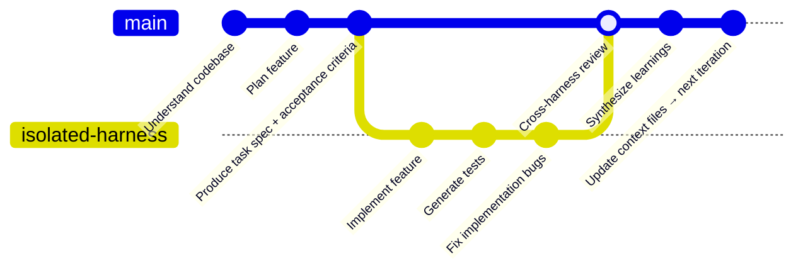

# Routing Work Across AI Harnesses

## Why Routing Matters

The era of picking one AI coding tool is ending. Developers extracting the most
value today use multiple harnesses and route work based on what each task needs.

The skill is not in mastering either tool. It is knowing which harness's architectural
disposition matches the kind of work you are doing right now.

> "He uses Claude Code for planning, orchestrating his terminal, and explaining how
> parts of the codebase work... Codex is for the actual code because the Codex code
> just straight up has fewer bugs."

This is not a preference — it reflects a structural difference in what each harness
is architecturally suited for.

---

## The Two Harness Dispositions

Before routing, understand the dispositions:

| Disposition | Characteristics | Suited For |
|---|---|---|
| **Collaborative / Local** | Full access to your environment; composable tools; structured artifacts for memory; orchestrated sub-agents; human in the loop | Planning, exploration, orchestration, deep-context work, creative synthesis |
| **Isolated / Enforced** | Sandboxed containers; repo-as-memory; mechanical constraint enforcement; coordination via git; deterministic output | Implementation, parallel independent tasks, safety-critical code generation, verifiable acceptance criteria |

These dispositions are not better or worse — they are optimized for different stages
and types of work.

---

## Task Routing Decision Framework

For each task, classify it on these four axes before assigning a harness:

### Axis 1: Planning vs. Implementation

| Task Type | Preferred Harness Disposition |
|---|---|
| Understanding codebase architecture | Collaborative / Local |
| Planning a feature or refactor | Collaborative / Local |
| Generating explanation or documentation | Collaborative / Local |
| Writing implementation code | Isolated / Enforced |
| Bug reproduction and fix | Isolated / Enforced |
| Test generation | Isolated / Enforced |

---

### Axis 2: Depth vs. Breadth

| Task Type | Preferred Harness Disposition |
|---|---|
| Deep understanding of one interconnected codebase area | Collaborative / Local (compacting context manager) |
| Many independent parallel tasks (e.g., 10 separate bug fixes) | Isolated / Enforced (separate sandboxes, no context pollution) |
| Orchestrating multiple sub-agents on a complex feature | Collaborative / Local (orchestration model) |

---

### Axis 3: Autonomy vs. Oversight

| Task Type | Preferred Harness Disposition |
|---|---|
| Tasks where human review at each step is acceptable | Collaborative / Local |
| Fully autonomous long-running tasks | Isolated / Enforced |
| Tasks touching production systems or security-sensitive code | Isolated / Enforced |
| Tasks where creative suggestions are valuable | Collaborative / Local |

---

### Axis 4: Tool Access Requirements

| Task Type | Preferred Harness Disposition |
|---|---|
| Requires SSH keys, local services, environment variables | Collaborative / Local |
| Requires only the code repository and standard tools | Isolated / Enforced |
| Requires integration with Jira, Figma, Slack, internal APIs | Check MCP compatibility; Collaborative / Local often broader |
| Requires browser-driven UI validation | Isolated / Enforced (native browser automation) |

---

## Recommended Hybrid Workflow Pattern

A high-performing pattern observed in practice:



The `main` branch represents the **collaborative/local harness** (planning, orchestration, synthesis). The `isolated-harness` branch represents the **isolated/enforced harness** (implementation, test generation, deterministic output). The merge point is where the isolated harness's output is reviewed by the collaborative harness — cross-checking exploits their structural differences.

1. **START** with the collaborative harness — plan, understand codebase, orchestrate work breakdown
2. **HAND OFF** to the isolated harness — implement against defined acceptance criteria
3. **REVIEW** with the isolated harness — catch bugs the planning harness missed
4. **RETURN** to the collaborative harness — synthesize learnings, update context files, plan next iteration

---

## Handoff Protocol Design

When routing between harnesses, define explicit handoff contracts:

### Handoff: Collaborative → Isolated (Planning to Implementation)

The collaborative harness should produce before handoff:
- A discrete, unambiguous task specification (not a high-level goal)
- Acceptance criteria the isolated harness can verify programmatically
- Relevant codebase context (file paths, interfaces, constraints)
- Definition of done (what "complete" looks like in a way the agent can check)

**Anti-pattern**: Handing off "build the authentication feature" without acceptance
criteria. The isolated harness needs something measurable.

---

### Handoff: Isolated → Collaborative (Implementation to Review/Next Step)

The isolated harness produces:
- A pull request or git branch with changes
- Test results and coverage
- Any unresolved ambiguities or conflicts encountered

The collaborative harness then:
- Reviews the output in full codebase context
- Updates the progress log and context files
- Plans next steps

---

## Task Routing Quick Reference

```
TASK ROUTING DECISION
======================

Is this a planning / exploration / explanation task?
  → Collaborative / Local harness

Is this an implementation / code generation / bug fix?
  → Isolated / Enforced harness

Does this require deep, interconnected codebase understanding?
  → Collaborative / Local harness

Are these many independent parallel tasks?
  → Isolated / Enforced harness

Is autonomous safety a primary concern?
  → Isolated / Enforced harness

Does the agent need to reach local tools (SSH, env vars, local services)?
  → Collaborative / Local harness

Do you want creative suggestions beyond what was specified?
  → Collaborative / Local harness

Do you need deterministic, low-bug output?
  → Isolated / Enforced harness
```

---

## Team-Level Routing Standardization

For engineering teams, codify routing decisions to reduce per-developer overhead:

| Task Category | Assigned Harness | Acceptance Criteria Format | Review Protocol |
|---|---|---|---|
| Feature planning | Collaborative | N/A | Human review |
| Feature implementation | Isolated | Automated test pass | Cross-harness review |
| Bug investigation | Collaborative | N/A | Human diagnosis |
| Bug fix | Isolated | Regression test pass | Automated |
| Architecture review | Collaborative | N/A | Human review |
| Parallel refactoring | Isolated | Linter + test pass | PR merge |

Document this in your team's engineering handbook. Uncodified routing decisions
drift back to single-harness defaults over time.

---

## Anti-Patterns

### Anti-Pattern: Defaulting to one harness for all tasks
Using one tool for everything because the team is comfortable with it ignores the
structural performance difference. The collaborative harness generates less consistent
code than the isolated harness. The isolated harness is less capable at orchestrating
complex multi-step exploration.

**Fix**: Map your highest-volume task categories to the routing framework. Even
routing 20% of tasks to the better-suited harness yields significant quality gains.

### Anti-Pattern: No handoff contract
Switching harnesses mid-task without a clear handoff contract (acceptance criteria,
context package, definition of done) causes the receiving harness to restart context
reconstruction from scratch.

**Fix**: Define handoff contracts for each transition point. The handoff package is
cheap to produce and avoids expensive context reconstruction.

### Anti-Pattern: Having one harness check its own work
Using the same harness to review its own output catches fewer bugs than cross-harness
review. The structural differences in how each harness generates code mean they make
different kinds of mistakes — cross-checking exploits this.

**Fix**: Route review tasks to the harness that did not generate the output. The
performance difference in cross-review is structural, not coincidental.

---

## References

- Harness dimension comparison → `evaluating-ai-harness-dimensions/SKILL.md`
- Lock-in risk of hybrid workflow dependencies → `detecting-harness-lockin/SKILL.md`
