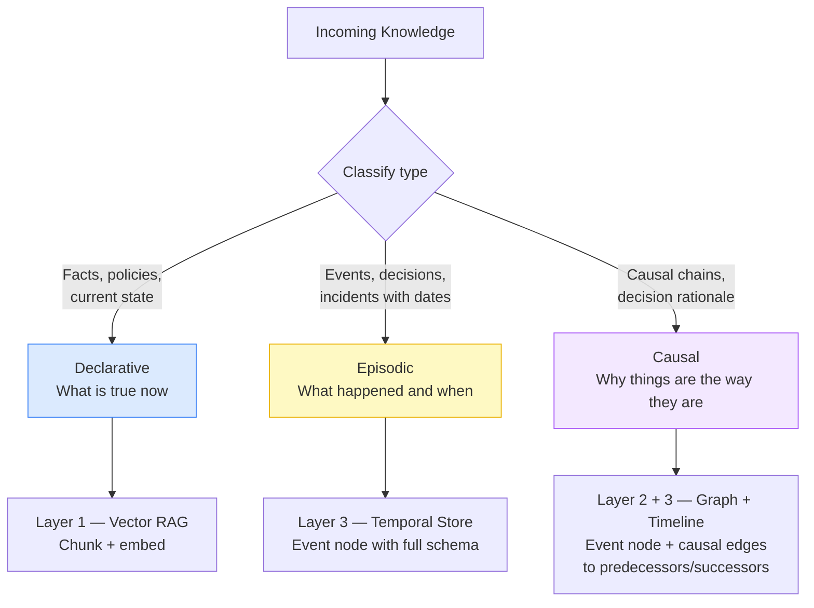
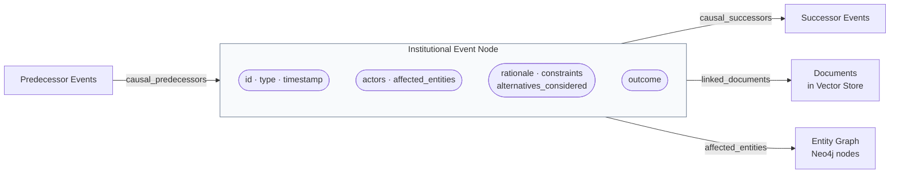

# Synthesizing Institutional Knowledge

## Why Embedding-Based Retrieval Loses Institutional Context

When a document is chunked and embedded, the resulting vector captures *semantic content* — what the document says. It does not capture:

- **Who** decided this and under what authority
- **Why** — the constraints, alternatives considered, and trade-offs made
- **When** — and what was happening organizationally at the time
- **What it superseded** — the decision it replaced and why the old one failed
- **What it caused** — decisions and events that followed from it

This lost provenance is exactly what makes questions like "why are we doing it this way?" impossible to answer from a standard RAG system. The documents exist; the institutional reasoning does not.

---

## The Three Knowledge Types

### 1. Declarative Knowledge — "What is true now"
Facts, policies, configurations, documentation.
- *Appropriate storage*: Vector RAG (Layer 1)
- *Examples*: API docs, runbooks, policy documents, current architecture diagrams

### 2. Episodic Knowledge — "What happened and when"
Events, decisions, incidents, changes — with temporal context.
- *Appropriate storage*: Temporal/episodic store (Layer 3)
- *Examples*: Incident reports, architectural decision records, deployment events, personnel changes

### 3. Causal Knowledge — "Why things are the way they are"
The reasoning chains that connect events: A happened because of B, which was caused by C.
- *Appropriate storage*: Knowledge graph with causal edges (Layer 2 + Layer 3)
- *Examples*: Decision trees, root cause analyses, strategic rationale documents

Most organizations capture Type 1 well. Type 2 partially (if they write incident reports). Type 3 almost never, because it requires explicit capture at the time of the decision.

---

## Knowledge Type Routing



---

## Schema for Institutional Events

Every knowledge event should be captured with this structure:

```json
{
  "id": "evt_2024_03_15_auth_migration",
  "type": "decision | incident | change | policy | external",
  "timestamp": "2024-03-15T14:00:00Z",
  "title": "Decision to migrate auth to OAuth2",
  "description": "Full narrative of what happened",
  "actors": ["eng-lead-alice", "cto-bob"],
  "affected_entities": ["auth-service", "api-gateway", "mobile-app"],
  "causal_predecessors": ["evt_2024_02_01_auth_breach_incident"],
  "causal_successors": ["evt_2024_04_10_mobile_app_update"],
  "rationale": "OAuth2 selected over SAML due to mobile SDK support and team familiarity",
  "alternatives_considered": ["SAML 2.0", "Custom JWT implementation"],
  "constraints": ["Must complete before Q2 product launch", "Budget: $40k"],
  "outcome": "Completed. Reduced auth-related incidents by 60% in following quarter.",
  "linked_documents": ["doc_oauth2_design_spec", "doc_q1_incident_review"],
  "tags": ["authentication", "security", "migration"]
}
```

---

### Event Relationship Model



---

## Ingestion Workflow

When adding new knowledge to the institutional memory system:

1. **Classify the knowledge type** — declarative, episodic, or causal
2. **Route to the right store**:
   - Declarative → chunk and embed to vector store (Layer 1)
   - Episodic → create event node with full schema above (Layer 3)
   - Causal → create event node AND graph edges to predecessors/successors (Layer 2 + 3)
3. **Link entities** — connect the event node to all affected systems, teams, and people in the graph
4. **Set causal edges** — explicitly link predecessor events that caused this one
5. **Index for temporal retrieval** — ensure timestamp is indexed for range queries

### For retroactive ingestion (legacy docs):
- Use the model to extract event structure from existing documents (ADRs, post-mortems, meeting notes)
- Human review the extracted causal edges — they require judgment the model may not have
- Accept incomplete provenance; partial coverage is better than no coverage

---

## Query Patterns for Each Knowledge Type

**Declarative queries** (go to Layer 1):
```
"What does [policy] say about [topic]?"
→ Vector search on policy corpus
```

**Episodic queries** (go to Layer 3):
```
"What happened to [system] between [date A] and [date B]?"
→ Timeline query: SELECT events WHERE affected_entities CONTAINS system AND timestamp BETWEEN A AND B
```

**Causal queries** (go to Layer 2 + 3):
```
"Why do we use [technology X]?"
→ Graph traversal: FIND events WHERE outcome contains X, TRAVERSE causal_predecessors 3 hops
```

---

## References

- Knowledge schema patterns with extended examples → `references/knowledge-schema-patterns.md`
